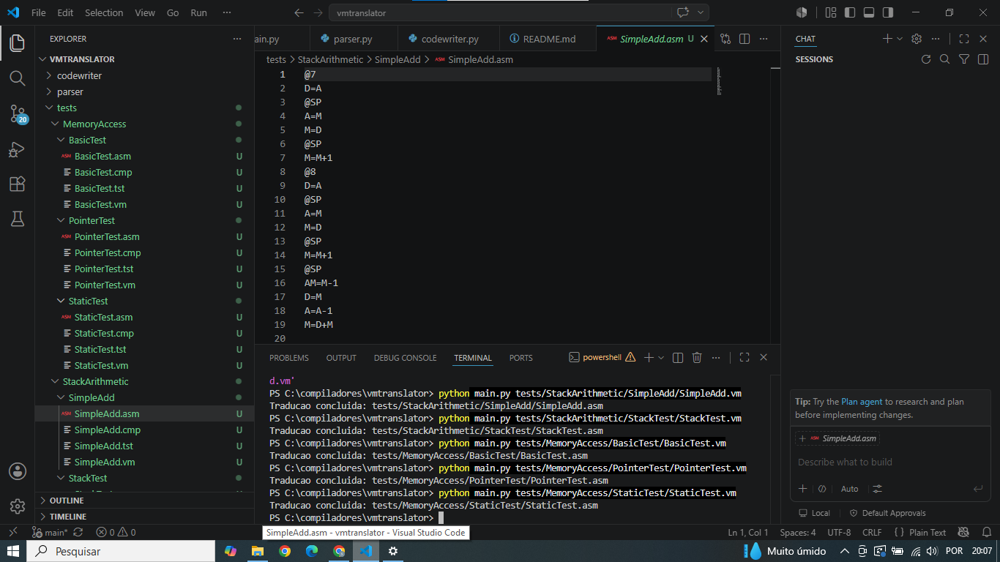
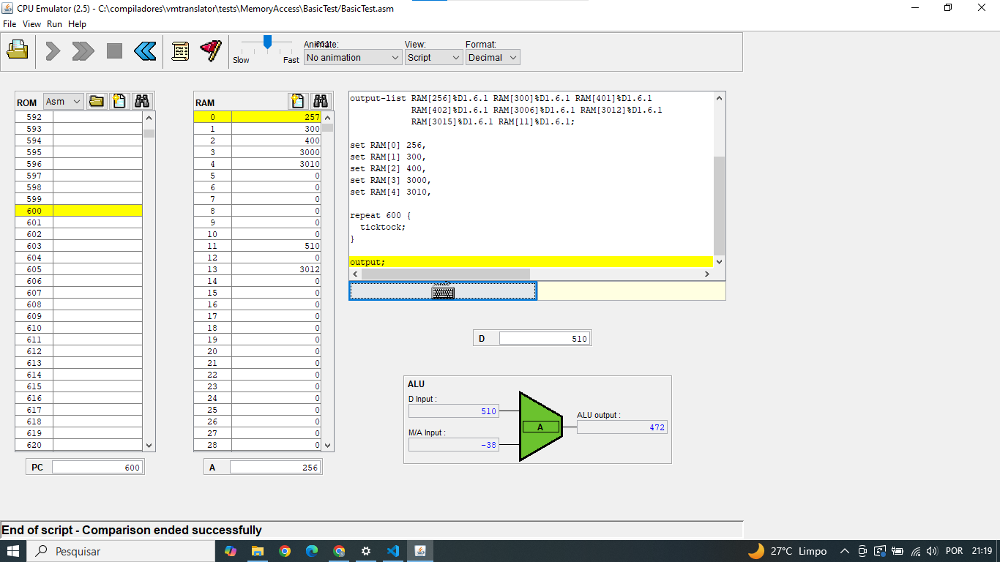

# VMTranslator – Parte 1

Tradutor de código VM (Virtual Machine) do Nand2Tetris para Assembly da CPU Hack, implementado como a primeira etapa do projeto: comandos de acesso à memória (`push`/`pop`) e operações aritméticas e lógicas.

---

## Integrante

- **Samara Santos Viegas** — Matrícula: **2022042898**
---

## Linguagem de programação e versão

- **Python 3** (desenvolvido e testado com Python 3.11, mas compatível com qualquer versão 3.8+)
- Nenhuma biblioteca externa foi utilizada — apenas a biblioteca padrão do Python.

### Justificativa da escolha

Escolhi o Python pela sintaxe simples e por não exigir configuração de compilação, gerenciamento de dependências, etc. O que me permitiu focar na lógica de tradução VM → Assembly, que é o objetivo da atividade.

---

## Instruções de build e execução

É necessário apenas ter o Python 3 instalado.

### 1. Pré-requisito

Verificar se o Python 3 está instalado:

```bash
python --version
# ou, em alguns sistemas:
python3 --version
```

### 2. Executando o tradutor

Na raiz do projeto, rode:

```bash
python main.py caminho/para/Arquivo.vm
```

O programa lê o arquivo `.vm` informado e gera, na **mesma pasta**, um
arquivo `.asm` com o mesmo nome (apenas trocando a extensão).

### Exemplo de uso

```bash
python main.py tests/StackArithmetic/SimpleAdd/SimpleAdd.vm
```

Saída no terminal:

```
Traducao concluida: tests/StackArithmetic/SimpleAdd/SimpleAdd.asm
```

Isso gera o arquivo `tests/StackArithmetic/SimpleAdd/SimpleAdd.asm` ,pronto para ser carregado e validado no CPU Emulator do Nand2Tetris (via o script `.tst` correspondente).

---

## Estrutura do projeto

```
vmtranslator/

├── codewriter/
│   ├── __init__.py
│   └── codewriter.py    # Geração do código Assembly Hack
├── parser/
│   ├── __init__.py
│   └── parser.py        # Leitura e tokenização do arquivo .vm
├── tests/
│   ├── StackArithmetic/
│   │   ├── SimpleAdd/
|   │   │   ├── SimpleAdd.vm
|   │   │   ├── SimpleAdd.tst
|   │   │   └── SimpleAdd.cmp
│   │   └── StackTest/
|   │   |    ├── StackTest.vm
|   │   |    ├── StackTest.tst
|   │   |    └── StackTest.cmp
│   |└── MemoryAccess/
│   |    ├── BasicTest/
|   |    |   ├── BasicTest.vm
|   |    │   ├── BasicTest.tst
|   |    │   └── BasicTest.cmp
│   |    ├── PointerTest/
|   |    |   ├── PointerTest.vm
|   |    │   ├── PointerTest.tst
|   |    │   └── PointerTest.cmp
│   |    └── StaticTest/
|   |    |   ├── StaticTest.vm
|   |    │   ├── StaticTest.tst
|   |    │   └── StaticTest.cmp
├── main.py               # Ponto de entrada (orquestrador)
├── README.md
└── .gitignore
```

---

## Detalhamento de cada parte implementada

### 1. Parser (`parser/parser.py`)

Responsável por ler o arquivo `.vm`, remover comentários (tudo depois de `//`) e linhas em branco, e permitir percorrer os comandos um a um.

| Método | O que faz || --- | --- |
| `Parser(filename)` | Abre o arquivo `.vm` e prepara a lista de comandos já limpa (sem comentários/linhas vazias) || `has_more_command ()` | Retorna `True` enquanto ainda houver comando a processar || `advance()` | Avança para o próximo comando da lista, tornando-o o "comando atual" || `command_type()` | Analisa o comando atual e retorna seu tipo: `C_ARITHMETIC`, `C_PUSH` ou `C_POP` || `arg1()` | Retorna o primeiro argumento do comando (ex.: `local`, `argument`...). Para comandos aritméticos, retorna o próprio nome do comando (ex.: `add`) || `arg2()` | Retorna o índice numérico do comando (usado só em `push`/`pop`) | Internamente, cada comando é armazenado como uma string já "limpa" 
(ex.:
`"push local 2"`), e os métodos `arg1`/`arg2` apenas fazem o `split()` dessa string para extrair as partes relevantes.

### 2. CodeWriter (`codewriter/codewriter.py`)

Responsável por traduzir cada comando VM (já interpretado pelo `Parser`) para uma sequência de instruções Assembly Hack, escrevendo-as diretamente no arquivo `.asm` de saída.

| Método | O que faz || --- | --- || `CodeWriter(filename)` | Abre o arquivo `.asm` de saída para escrita || `write_arithmetic(command)` | Gera o código para `add`, `sub`, `neg`, `eq`, `gt`, `lt`, `and`, `or`,`not` || `write_push(segment, index)` | Gera o código que empilha um valor vindo do segmento indicado || `write_pop(segment, index)` | Gera o código que desempilha o topo da pilha e grava no segmento indicado || `close()` | Fecha o arquivo `.asm` |

**Operações aritméticas e lógicas implementadas:**

| Comando VM | O que faz || --- | --- || `add` | Soma os dois valores do topo da pilha || `sub` | Subtrai (segundo valor − topo) || `neg` | Inverte o sinal do valor do topo || `eq` | Empilha `-1` (verdadeiro) se os dois valores do topo forem iguais, senão `0` || `gt` | Empilha `-1` se o segundo valor for maior que o topo || `lt` | Empilha `-1` se o segundo valor for menor que o topo || `and` | AND bit a bit entre os dois valores do topo || `or` | OR bit a bit entre os dois valores do topo || `not` | Inverte todos os bits do valor do topo |

As comparações (`eq`, `gt`, `lt`) precisam de desvios condicionais em
Assembly, então cada ocorrência gera um rótulo único (`TRUE_0`,`END_0`,
`TRUE_1`, `END_1`, ...), evitando que comparações diferentes no mesmo programa colidam entre si.

**Segmentos de memória implementados:**

| Segmento | Descrição | Como é traduzido || --- | --- | --- |
| `constant` | Valor literal (não ocupa memória real) | O valor é carregado diretamente com `@X` / `D=A` |
| `local` | Variáveis locais da função | Endereço relativo a `LCL` (RAM[1]) || `argument` | Argumentos recebidos pela função | Endereço relativo a `ARG` (RAM[2]) || `this` | Base para objetos/arrays | Endereço relativo a `THIS` (RAM[3]) |
| `that` | Base para estruturas dinâmicas | Endereço relativo a `THAT` (RAM[4]) || `temp` | Registradores temporários fixos | RAM[5] até RAM[12] (`temp i` → RAM[5+i]) || `pointer` | Acesso direto a `this`/`that` | `pointer 0` → THIS, `pointer 1` → THAT || `static` | Variáveis estáticas da classe | Endereço simbólico `NomeDoArquivo.i`, resolvido pelo próprio montador |Para `push`/`pop` de `local`, `argument`, `this` e `that`, o endereço final é calculado somando o índice ao valor guardado no ponteiro base 
(ex.:
`endereço = LCL + index`), e não ao endereço fixo do ponteiro em si — essa foi a principal fonte de erro durante o desenvolvimento, já que é fácil confundir "o endereço apontado por LCL" com "o próprio registrador LCL".

### 3. Main (`main.py`)

É o ponto de entrada do programa. Lê o argumento de linha de comando (o
caminho do `.vm`), cria um `Parser` para o arquivo de entrada e um
`CodeWriter` para o arquivo de saída, e percorre todos os comandos chamando o método apropriado do `CodeWriter` conforme o tipo de cada comando:

```python
parser = Parser(input_path)
codewriter = CodeWriter(output_path)

while parser.has_more_commands():
    parser.advance()
    cmd_type = parser.command_type()

    if cmd_type == Parser.C_ARITHMETIC:
        codewriter.write_arithmetic(parser.arg1())
    elif cmd_type == Parser.C_PUSH:
        codewriter.write_push(parser.arg1(), parser.arg2())
    elif cmd_type == Parser.C_POP:
        codewriter.write_pop(parser.arg1(), parser.arg2())

codewriter.close()
```

---

## Testes realizados

Os testes foram feitos com os arquivos oficiais disponibilizados em:
`https://github.com/profsergiocosta/nand2tetris-notes/tree/main/projects/07`



Validação feita via CPU Emulator do Nand2Tetris, carregando o script `.tst` e conferindo a mensagem `Comparison ended successfully`:


- [x] `StackArithmetic/SimpleAdd`
- [x] `MemoryAccess/BasicTest`